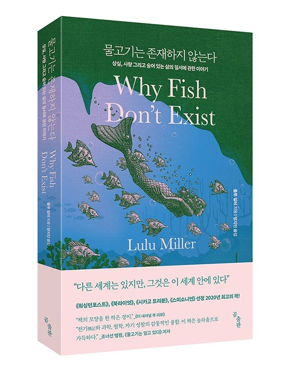

---
# 커버의 타이틀과 서브 타이틀
title: "서울시 인구통계"
subtitle: "사용 예시를 위한"
# 커버의 초록 상자를 만듭니다. 간결하게 기술해야 합니다.
# 초록이 없는 전체 이미지 커버를 원한다면, YAML에서 abstract-title와 abstract를 제거합니다.
abstract-title: 보고서 개요
abstract: "본 통계 리포트는 bitReport의 **페이지 보고서**의 **조판 및 서식** 기능을 이용해서 작성했습니다. 여러분은 **R 마크다운 문서를 수정**하여 원하는 **데이터 분석 보고서를 제작**할 수 있습니다. HTML 파일이나 PDF 파일로 출력이 가능하며, **기업의 BI/통계 시스템을 구축에 응용**할 수 있습니다."
# 날짜는 바닥글에서 사용합니다.
date: "`r Sys.Date()`"
# author는 문서를 만드는 사람입니다. 문서에는 나타나지 않지만 DOM의 일부가 됩니다.
# 문서 뒷표지의 연락처는 본 템플리트 뒷부분을 참고해서 수정하세요.

output: 
    # bitReport::bitR_blue_paged 템플리트는 파란색 디자인 템플리트도 사용 가능함
  bitReport::bitR_blue_paged: 
    # 커버 페이지의 백그라운드 이미지
    front_cover: img/gwangwhamoon.jpg
    # 뒷커버 페이지의 백그라운드 이미지
    # orange 테마 경우는 backcover_orange.png, blue 테마 경우는 backcover_blue.png    
    # 아니면 사용자의 백드라운드 이미지를 사용합니다.
    back_cover: img/backcover_blue.png    
    # 목차를 제거하려면 false로 변경하십시오.
    toc: true
    # 챕터 앞에 숫자를 추가하려면 true로 변경하십시오.
    number_sections: false
    self_contained: true
# 목차의 제목 설정, 기본값 없음
toc-title: Contents
# 테이블 목록을 제거하려면 false로 변경하십시오
lot: false
# 테이블 목록의 제목 설정, 기본값은 "List of Tables"
lot-title: "Tables"
# 그림 목록을 제거하려면 false로 변경하십시오.
lof: false
# 그림 목록의 제목 설정, 기본값은 "List of Figures"
lof-title: "Figures"
# 문서에 <abbr>을 포함하면 약어 목록이 작성됩니다.
# 약어 목록의 제목 설정, 기본값은 "List of Abbreviations"
loa-title: "Acronyms"
# 관련 페이지에 각주를 포함합니다.
paged-footnotes: true
# PDF 인쇄 시 각주 링크 켜기/끄기
links-to-footnotes: true
# RStudio에서 HTML 및 PDF를 생성하려면 이 줄의 주석 처리를 제거하십시오.:
#knit: pagedown::chrome_print
---

```{r setup, include=FALSE}
knitr::opts_chunk$set(echo = TRUE)
```

```{r packages, include=FALSE, message=FALSE, warning=FALSE}
library(bitReport)
library(tidyverse)
library(scales)
library(sf)
library(formattable)
library(reactable)
library(htmltools)

update_geom_font_defaults()
```

```{r create-css, echo=FALSE, message=FALSE, warning=FALSE}
##==============================================================================
## Cover 페이지의 일부 형식과 바닥글의 서식을 지정합니다.
##==============================================================================

## 타이틀의 폰트 색상을 지정합니다.
title_color <- "white"

## 서브 타이틀의 폰트 색상을 지정합니다.
subtitle_color <- "gold"

## 표지 우측 상단의 로고 이미지를 지정합니다.
## 지정하지 않으면, 한국R사용자회 로고를 출력합니다.
logo_img <- NULL

if (is.null(logo_img)) {
  logo_file <- file.path(system.file(package = "bitReport"), "resources", "image", "koRea_logo.png")
  base64_logo <- knitr::image_uri(logo_file)
} else {
  base64_logo <- knitr::image_uri(logo_img)
}

## 문서 하단의 텍스트를 지정합니다.
## 지정하지 않으면, bitReport를 출력합니다.
botoom_txt <- NULL

if (is.null(botoom_txt)) {
  botoom_txt <- "bitReport"
} 

## Back-Cover의 이미지를 지정합니다.
## 지정하지 않으면, 한국R사용자회 이미지를 출력합니다.
## orange 테마의 경우에는 backcover_orange.png, blue 테마인 경우에는 backcover_blue.png를 지정합니다.
## --> 아래 코드에서 수정이 필요함
back_cover <- NULL

if (is.null(back_cover)) {
  back_cover_file <- file.path(system.file(package = "bitReport"), "resources", "image", "backcover_orange.png")
  base64_back_cover <- knitr::image_uri(back_cover_file)
} else {
  base64_back_cover <- knitr::image_uri(back_cover)
}

str_css <- paste0(
".pagedjs_page.pagedjs_first_page .pagedjs_margin-top-right>.pagedjs_margin-content::after {
    content: url('", base64_logo, "') !important;
}

.title {
  color: {title_color};
}

.subtitle {
  color: {subtitle_color};
  font-size: 2.5em !important;  
}

.pagedjs_page.pagedjs_named_page.pagedjs_chapter_page.pagedjs_left_page .pagedjs_margin-bottom-right>.pagedjs_margin-content::after {
    content: '", botoom_txt, " / ' var(--pagedjs-string-first-date-text);
}

.pagedjs_page.pagedjs_named_page.pagedjs_chapter_page.pagedjs_right_page .pagedjs_margin-bottom-left>.pagedjs_margin-content::after {
    content: '", botoom_txt, " / ' var(--pagedjs-string-first-date-text);
}

/* Warnings */
.tag {
  display: inline-block;
  padding: 2px 12px;
  border-radius: 5px;
  font-weight: 600;
  font-size: 12px;
}

.recommand-check {
  background: hsl(116, 60%, 90%);
  color: hsl(116, 30%, 25%);
}

.recommand-judgement {
  background: hsl(230, 70%, 90%);
  color: hsl(230, 45%, 30%);
}

.recommand-remove {
  background: hsl(350, 70%, 90%);
  color: hsl(350, 45%, 30%);
}
")

fileConn <- file("prams.css")
writeLines(str_css, fileConn)
close(fileConn)

htmltools::includeCSS("prams.css")
```


```{r, get-maps, include=FALSE}
##==============================================================================
## 01.02. Set parameters
##==============================================================================
##------------------------------------------------------------------------------
## 01.02.01. Locations
##------------------------------------------------------------------------------
mega_cd        <- "11"
mega_nm        <- "서울특별시"
mega_abb_nm    <- "서울시"

cty_cds <- c("1111", "1114", "1117", "1120", "1121",
             "1123", "1126", "1129", "1130", "1132",
             "1135", "1138", "1141", "1144", "1147",
             "1150", "1153", "1154", "1156", "1159",
             "1162", "1165", "1168", "1171", "1174")
cty_nms <- c("종로구", "중구", "용산구", "성동구", "광진구",
             "동대문구", "중랑구", "성북구", "강북구", "도봉구",
             "노원구", "은평구", "서대문구", "마포구","양천구",
             "강서구", "구로구", "금천구", "영등포구", "동작구",
             "관악구", "서초구", "강남구", "송파구", "강동구")
legend_pos <- c("topright", "bottomleft", "bottomright", "topright", "topleft", 
                "topleft", "bottomright", "bottomright", "topright", "bottomleft", 
                "topright", "bottomright", "topleft", "topright", "topcenter", 
                "topright", "bottomcenter", "topright", "topright", "bottomcenter", 
                "topright", "topright", "topright", "topright", "bottomright")

##------------------------------------------------------------------------------
## 01.02.02. Dates
##------------------------------------------------------------------------------
base_ym        <- "202210"

##------------------------------------------------------------------------------
## 01.03. Load UDF 
##------------------------------------------------------------------------------
## Common function
rfiles <- list.files(here::here("R", "01_common"), 
                    pattern = "\\.(r|R)$", full.names = TRUE)
for (rfile in rfiles) {
  source(rfile, local = TRUE)
}

## Import data
rfiles <- list.files(here::here("R", "02_import_data"), 
                    pattern = "\\.(r|R)$", full.names = TRUE)
for (rfile in rfiles) {
  source(rfile, local = TRUE)
}

## Design viz and tables
rfiles <- list.files(here::here("R", "03_page_rendering"), 
                    pattern = "\\.(r|R)$", full.names = TRUE)
for (rfile in rfiles) {
  source(rfile, local = TRUE)
}
```

```{r, import-data, include=FALSE, cache=FALSE, cache=TRUE}
################################################################################
## 02. Import data from DBMS
################################################################################
load(here::here("data", "seoul.rda"))
```

# 교보문고

```{r table, echo=FALSE, message=FALSE}
books <- data.frame(
  popularity_rank = 1:10,
  title = c("물고기는 존재하지 않는다",
            "나를 나답게 만드는 것들",
            "코스모스",
            "우리는 각자의 세계가 된다",
            "이기적 유전자",
            "다정한 것이 살아남는다",
            "종의 기원",
            "면역",
            "복잡한 세상을 이기는 수학의 힘",
            "이과형의 만만한 과학책"),
  release_date = c("2021", "2020", "2010", "2022", "2018", "2021", "2019", "2022", "2023", "2023"),  
  author = c("룰루 밀러", "빌 설리번", "칼 세이건", "데이비드 이글먼", "리처드 도킨스",
             "브라이언 헤어", "찰스 다윈", "필리프 데트머", "류쉐펑", "이과형"),
  publisher = c("곰출판", "브론스테인", "사이언스북스", "알에이치코리아", "을유문화사",
                "디플롯", "사이언스북스", "사이언스북스", "미디어숲", "토네이도"),
  pages = c(850, 990, 990, 1100, 1000, 1100, 1100, 1750, 1100, 890),
  price = c("17,000원", "19,800원", "19,900원", "22,000원", "20,000원",
            "22,000원", "22,000원", "35,000원", "22,000원", "17,800원"),
  score = c(95, 94, 92, 88, 87, 86, 84, 83, 82, 80)
)
```


### 베스트셀러 현황

```{css, echo=FALSE}
.bg-blue>*:last-child, .bg-orange>*:last-child, .bg-grey>*:last-child {
    margin-top: 0;    
    margin-bottom: 0;
    padding-top: 0;
    padding-bottom: 0;    
}

table {
    caption-side: bottom;
    font-family: 'NanumSquare';
    border-collapse: collapse;
}

.pagedjs_pages > .pagedjs_page > .pagedjs_sheet > .pagedjs_pagebox > .pagedjs_area > div [data-split-from] {
    font-family: 'NanumSquare';
}
```

```{r, echo=FALSE}
rmd_name <- "Kniter_Temp_dir"

dir_main <- here::here(glue::glue("{rmd_name}_files"))
dir_sub <- here::here(glue::glue("{rmd_name}_files"), "figure-html")

if (!file.exists(dir_main)) {
  dir.create(dir_main)
} 

if (!file.exists(dir_sub)) {
  dir.create(dir_sub)
} 
```

```{r best-seller, echo=FALSE, message=FALSE, warning=FALSE, cache=TRUE}
knitr::kable(books %>% 
               select(순위=popularity_rank, 제목=title, 저자=author, 
                      출판사=publisher, 페이지=pages, 출판년도=release_date),
             table.attr = "class=\"table table-striped-blue table-width\"",
             format = "html",
             format.args = list(big.mark = ",", scientific = FALSE),
             caption = "과학분야 베스트셀러 현황")
```

:::{.bg-blue}
상위에 랭크한 도서는 대부분 번역서이며, 과학관련 주제의 유투버 이과형의 2023년 신간, "이과형의 만만한 과학책"이 유일한 국내 저작 출판물로 이름을 올렸습니다.
:::

#### 베스트셀러 1위 서평

:::: {style="display:grid; grid-template-columns: 15% 85%; grid-row-gap: 15px; align-self:start"}
::: {style="margin-top: 0px; margin-bottom: 0px;"}

```{r tidyverse, echo=FALSE, out.width = "80%"}

```

:::

::: {style="color:grey; margin-top: 20px;"}

"이 책은 완벽하다. 그냥 완벽하다고 할 수밖에 없다. 서정적인 동시에 지적이고, 개인적인 동시에 정치적이며, 사소하면서 거대하고 별나면서도 심오하다" -- 베스트셀러 '스티프(stiff)의 저자 메리 로치

:::
::::

:::{.col2 style="font-size: 14px !important;"}
"《**[물고기는 존재하지 않는다]{.custom-orange}**》는 세계라는 거대한 구조 속에서 '물고기는(그리고 우리는) 어떤 존재인가'에 관해 우리의 관념을 뒤집어엎으며 자유분방한 여정을 그려나간다. 사랑을 잃고 삶이 끝났다고 생각한 그 순간 ‘데이비드 스탄 조던’을 우연히 알게 된 저자는 그가 혼돈에 맞서 싸우는 것을 전혀 두려워하지 않는 모습에 매혹되어 그의 삶을 추적해나가기 시작한다. 저자 역시 이 세계에서 "혼돈이란 '그런 일이 일어난다면'의 가정의 문제가 아니라 '언제 일어나는가'의 시기의 문제"이며, 어느 누구도 이 진리를 피할 수 없다고 생각해왔기 때문이다. 하지만 조던의 이야기는 독자들을 전혀 예상하지 못한 곳으로 이끌며, 이윽고 엄청난 충격으로 우리의 눈을 번쩍 뜨이게 만든다."
:::


:::{.page-break}
:::

# 서식 및 조판 예제

### 차트를 포함한 테이블

```{r, echo=FALSE, message=FALSE, warning=FALSE, results='asis'}
library(htmltools)

rating_stars <- function(rating, max_rating = 5) {
  star_icon <- function(empty = FALSE) {
    tagAppendAttributes(shiny::icon("star"),
      style = paste("color:", if (empty) "#edf0f2" else "orange"),
      "aria-hidden" = "true"
    )
  }
  rounded_rating <- floor(rating + 0.5)  # always round up
  stars <- lapply(seq_len(max_rating), function(i) {
    if (i <= rounded_rating) star_icon() else star_icon(empty = TRUE)
  })
  label <- sprintf("%s out of %s stars", rating, max_rating)
  div(title = label, role = "img", stars)
}

ratings <- data.frame(
  제목 = c("물고기는 존재하지 않는다", "나를 나답게 만드는 것들", "코스모스", "우리는 각자의 세계가 된다"),
  별점 = c(4.65, 4.35, 4.5, 4.4),
  추천 = c(990, 370, 600, 490)
)

tab <- reactable(
  ratings, 
  columns = list(별점 = colDef(cell = function(value) rating_stars(value))),
  style = list(fontFamily = "NanumSquare, sans-serif", fontSize = "1.5rem")
)

fig_name <- here::here(dir_main, "figure-html", 
                       glue::glue("fig_{runif(1)}.png"))
html_name <- here::here("temp.html")

htmlwidgets::saveWidget(tab, file = html_name)
webshot2::webshot(html_name, file = fig_name)
tmp <- file.remove(html_name)
```


```{r, echo=FALSE, message=FALSE, warning=FALSE, results='asis'}
data <- books %>% 
  filter(row_number() <= 3) %>% 
  select(제목=title, ` `=title, 저자=author, 출판사=publisher, 
         출판년도=release_date)

tab <- reactable(
  data,
  style = list(fontFamily = "NanumSquare, sans-serif", fontSize = "1.4rem"),
  columns = list(
    제목 = colDef(cell = function(value) {
      img_src <- knitr::image_uri(here::here("img", 
                                             glue::glue("{value}.jpeg")))
      image <- img(src = img_src, style = "height: 50px;", alt = value)
      tagList(
        div(style = "display: inline-block; width: 45px; text-align: center;", image)
      )
    },
    width = 60),
    출판년도 = colDef(
      width = 100
    )
  ),
  defaultColDef = colDef(vAlign = "center")
)

fig_name <- here::here(dir_main, "figure-html", 
                       glue::glue("fig_{runif(1)}.png"))
html_name <- here::here("temp.html")

htmlwidgets::saveWidget(tab, file = html_name)
webshot2::webshot(html_name, file = fig_name)
tmp <- file.remove(html_name)
```


```{r, echo=FALSE, message=FALSE, warning=FALSE, results='asis'}
tab <- table_d_kpi(
  TB_D_KPIS, 
  platform_cd = c("IWL", "HMP", "LPS"),
  style = list(fontFamily = "NanumSquare, sans-serif", fontSize = "1.4rem")
)

fig_name <- here::here(dir_main, "figure-html", 
                       glue::glue("fig_{runif(1)}.png"))
html_name <- here::here("temp.html")

htmlwidgets::saveWidget(tab, file = html_name)
webshot2::webshot(html_name, file = fig_name)
tmp <- file.remove(html_name)
```

:::{.page-break}
:::

```{r formatable-d-kpi, echo=FALSE, message=FALSE, warning=FALSE, eval=FALSE}
formatable_d_kpi(TB_D_KPIS, fixed_width = 90)
```


### Information Visualization

```{r, echo=FALSE, message=FALSE, warning=FALSE, fig.cap="R을 이용한 InforViz", dpi=250, fig.width=7, fig.height=8, fig.align='center', out.width="100%"}
print(rain)
```


:::{.page-break}
:::

### 데이터 시각화 및 집계 테이블

#### 데이터 시각화

```{r single-line, echo=FALSE, message=FALSE, warning=FALSE, fig.cap="항공기 이용 승객 현황 - 단일 계열", dpi=300, fig.align='center', out.width="75%"}
air_passengers <- data.frame(
  year = trunc(time(AirPassengers)), 
  month = cycle(AirPassengers),
  n_passenger = AirPassengers
)

single_line <- air_passengers %>% 
  mutate(date = as.Date(glue::glue("{year}-{month}-01"))) %>% 
  ggplot2::ggplot(aes(x = date, y = n_passenger)) +
  geom_line(colour = bit_orange, size = 1) + # Define line chart color to bit_orange
  geom_hline(yintercept = 0, size = 1, colour = bit_grey) + # Add major line at 0
  labs(title = "항공기 이용 승객 현황 1949 ~ 1960",
       subtitle = "국제선 항공기 이용고객의 월 집계",
       caption = "Source: The classic Box & Jenkins airline") +
  scale_y_continuous(label = scales::label_number(scale_cut = scales::cut_short_scale())) + # Format axis number
  scale_x_date(date_labels = "%Y",
               breaks = scales::breaks_pretty(n = 7)) + # Add axis label every 5 months
  bit_theme(base_family = "NanumSquare", grid = "Y") +
  theme(axis.title.x = element_blank(),
        axis.title.y = element_blank()) # Remove axis title in this context

single_line
```

```{r, echo=FALSE, message=FALSE, warning=FALSE, fig.cap="GDP 추이현황 - 다중 계열", dpi=250, fig.width=9, fig.height=6, fig.align='center', out.width="75%"}
 plot_country_trend()
```

:::{.page-break}
:::

#### 집계 테이블

##### 기본 와이드 테이블

```{r, echo=FALSE, message=FALSE, warning=FALSE, cache=TRUE}
usa_crime <- USArrests %>% 
  tibble::rownames_to_column() %>% 
  filter(row_number() <= 5) %>% 
  rename(`주 이름` = rowname,
         `살인범수 (10만명당)` = Murder,
         `폭행범수 (10만명당)` = Assault,
         `도시인구 비율 (%)` = UrbanPop,
         `강간범수 (10만명당)` = Rape)

knitr::kable(usa_crime,
             table.attr = "class=\"table\"",
             format = "html",
             format.args = list(big.mark = ",", scientific = FALSE),
             caption = "미국 주별 강력 범죄율")
```

##### 블루 테마 테이블

```{r, echo=FALSE, message=FALSE, warning=FALSE, cache=TRUE}
knitr::kable(usa_crime,
             table.attr = "class=\"table table-striped-blue table-width\"",
             format = "html",
             format.args = list(big.mark = ",", scientific = FALSE),
             caption = "블루색 테마의 테이블")
```

##### 오랜지 테마 와이드 테이블

```{r, echo=FALSE, message=FALSE, warning=FALSE, cache=TRUE}
knitr::kable(usa_crime,
             table.attr = "class=\"table table-striped-orange table-orange\"",
             format = "html",
             format.args = list(big.mark = ",", scientific = FALSE),
             caption = "오랜지색 테마의 테이블")
```

:::{.page-break}
:::

# 인구통계

## 면적 및 인구 현황

```{css, echo=FALSE}
table {
    font-size: smaller;
}
```

```{r create-pop, echo=FALSE, message=FALSE, warning=FALSE, cache=TRUE}
path <- here::here("data") 
fname_gender <- "202206_202206_연령별인구현황_월간.csv"

population_mega <- readr::read_csv(
    glue::glue("{path}/{fname_gender}"),
    locale = readr::locale(encoding = "cp949"),
    show_col_types = FALSE
  ) %>%
  select(-all_of(matches("연령구간인구수|총인구수|계"))) %>%
  rename_with(function(x) stringr::str_replace(x, "남", "male")) %>%
  rename_with(function(x) stringr::str_replace(x, "여", "female")) %>%
  rename_with(function(x) stringr::str_replace(x, "행정구역", "CTY_NM")) %>%
  rename_with(function(x) stringr::str_remove(x, "2022년06월_")) %>%
  rename_with(function(x) stringr::str_remove(x, "세")) %>%
  rename_with(function(x) stringr::str_replace(x, " 이상", "_over")) %>%
  rename_with(function(x) stringr::str_replace(x, "~", "_")) %>%
  filter(!stringr::str_detect(CTY_NM, "1100000000")) %>%
  mutate(CTY_NM = stringr::str_remove_all(CTY_NM, glue::glue("{mega_nm} |\\(|\\)"))) %>%
  tidyr::gather(key, value, -CTY_NM) %>%
  tidyr::extract(key, c("gender", "population"), "([a-z]{4,6})\\_([[:print:]]+)") %>%
  tidyr::spread(population, value) %>%
  tidyr::extract(CTY_NM, c("CTY_NM", "CTY_CD"), "([가-힝]+) ([[:digit:]]+)") %>%
  rename_with(function(x) paste("age", x, sep = "_"), contains("0")) %>%
  mutate(CTY_CD = substr(CTY_CD, 1, 4))

stat_population <- population_mega %>%
  mutate(
    total_pop = age_0_9 + age_10_19 + age_20_29 + age_30_39 + age_40_49 +
      age_50_59 + age_60_69 + age_70_79 + age_80_89 + age_90_99 + age_100_over
  ) %>%
  group_by(CTY_NM, CTY_CD) %>%
  summarise(total_pop = sum(total_pop), .groups = "drop") %>%
  inner_join(
    seoul_df %>%
      mutate(area = st_area(seoul_df)) %>%
      filter(MEGA_CD %in% mega_cd) %>%
      group_by(CTY_NM) %>%
      summarise(
        area = sum(area) / 1000^2
      ),
    by = "CTY_NM"
  ) %>%
  select(-geometry) %>%
  mutate(density_pop = total_pop / area) %>%
  arrange(desc(density_pop)) %>% 
  mutate(area = as.numeric(area)) %>% 
  mutate(density_pop = as.numeric(density_pop))  
```

행정구역의 **면적**이 가장 넓은 지역은 **`r stat_population$CTY_NM[which.max(stat_population$area)]`**로 가장 좁은 지역인 **`r stat_population$CTY_NM[which.min(stat_population$area)]`**보다
약 `r round(stat_population$area[which.max(stat_population$area)] / stat_population$area[which.min(stat_population$area)], 0)`배 넓습니다.
**인구밀도**가 가장 높은 지역은 **`r stat_population$CTY_NM[1]`**로 가장 낮은 지역인 **`r stat_population$CTY_NM[25]`**보다
약 `r round(stat_population$density_pop[1] / stat_population$density_pop[25], 1)`배 높습니다.

```{r table-pop, echo=FALSE, message=FALSE, warning=FALSE}
knitr::kable(
  stat_population %>% select(-CTY_CD),
  table.attr = "class=\"table table-striped-blue\"",
  format = "html",
  col.names = c("구 이름", "인구(명)", "면적(km^2^)", "인구밀도(명/km^2^)"),
  format.args = list(big.mark = ",", digit = 2, scientific = FALSE),
  caption = "구별 면적 및 인구통계 현황 (2022년 6월 기준)")
```

:::{.page-break}
:::

```{r intro_cty, echo=FALSE, message=FALSE, warning=FALSE, dpi=200, fig.height=3.3, fig.width=7.6, fig.align='center', results='asis', cache=TRUE}
cty_cds %>% 
  seq() %>% 
  purrr::walk(
    function(x) {
      cty_cd        <- cty_cds[x]
      cty_nm        <- cty_nms[x]

      cat(paste("\n##", cty_nm, "\n"))

      fig <- get_public(tab_public, base_ym, mega_cd, mega_abb_nm, 
                        cty_cd, cty_nm, seoul_df, pos_legend = legend_pos[x])
      
      cat(paste("\n#### 일반현황", "\n"))
      
      html_h6(paste("\n#####", "연령대별 인구수 추이\n"))
      
      fig_name <- here::here(dir_main, "figure-html", 
                             glue::glue("population_{runif(1)}.svg"))
      
      ggsave(filename = fig_name, plot = fig$obj_01, device = "svg", 
             width = 7.6, height = 1.8, dpi = 200)
      
      cat(glue::glue(""), "\n")
      
      cat("<div style='width: 10px; height: 12px; background-color: #FFFFFF; border: 1px solid #FFFFFF;'></div>") 
      
      html_h6(paste("\n#####", "1인 가구 및 고령인구 비율\n"))
      
      fig_name <- here::here(dir_main, "figure-html", 
                             glue::glue("population_{runif(1)}.svg"))
      
      ggsave(filename = fig_name, plot = fig$obj_02, device = "svg", 
             width = 7.6, height = 2.7, dpi = 200)
      
      cat(glue::glue(""), "\n")
      
      cat("<div style='width: 10px; height: 12px; background-color: #FFFFFF; border: 1px solid #FFFFFF;'></div>") 
      
      html_h6(paste("\n#####", "읍면동별 인구수 분포 및 소득수준 분포\n"))
      
      fig_name <- here::here(dir_main, "figure-html", 
                             glue::glue("population_{runif(1)}.svg"))
      
      ggsave(filename = fig_name, plot = fig$obj_03, device = "svg", 
             width = 8, height = 3.8, dpi = 200)
      
      cat(glue::glue(""), "\n")      
      break_page_after()
    }
  )
```

:::{.page-break}
:::

::: {.back-cover}

::: {.back-header}
<h1 class="back-title"></h1>
<h1 class="back-subtitle"></h1>
:::

::: {.back-footer}
자세한 내용은 다음으로 문의하십시오:

::: {.back-contact}
[홍길동]{.back-name}

한국 R 사용자회

[contact1email@email.com](mailto:contact1email@email.com)
:::

:::

:::

